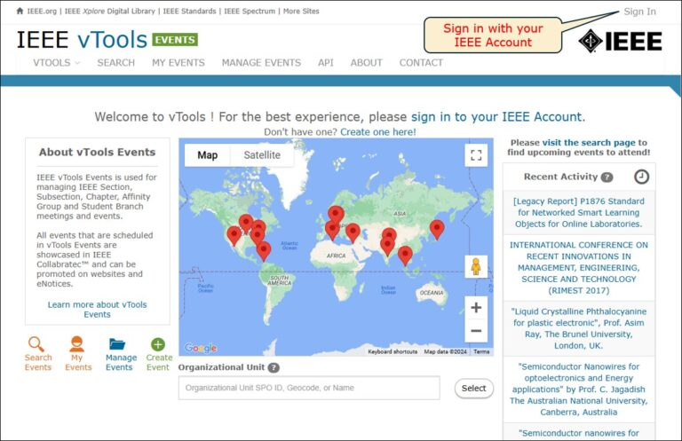
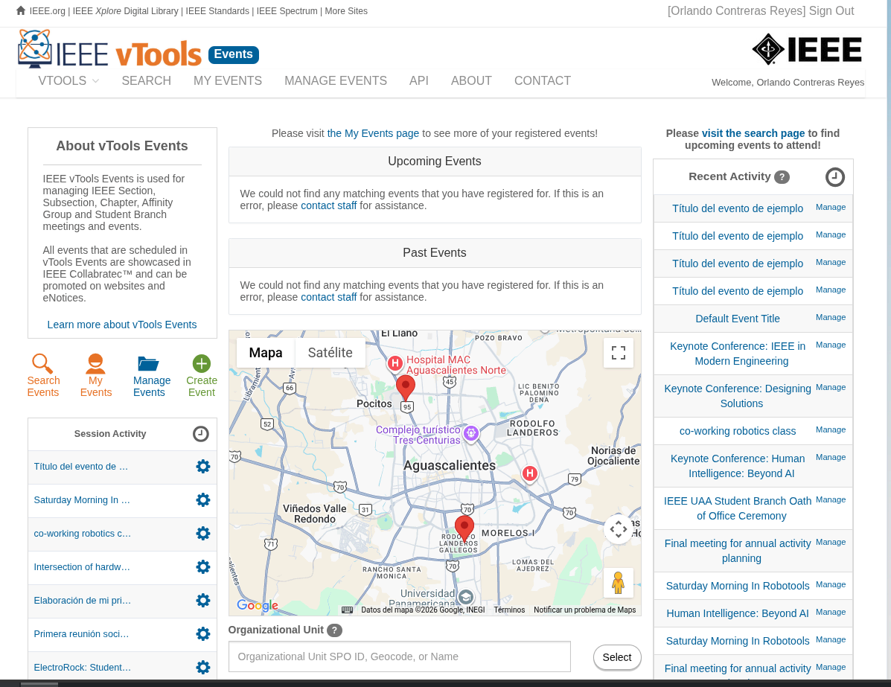
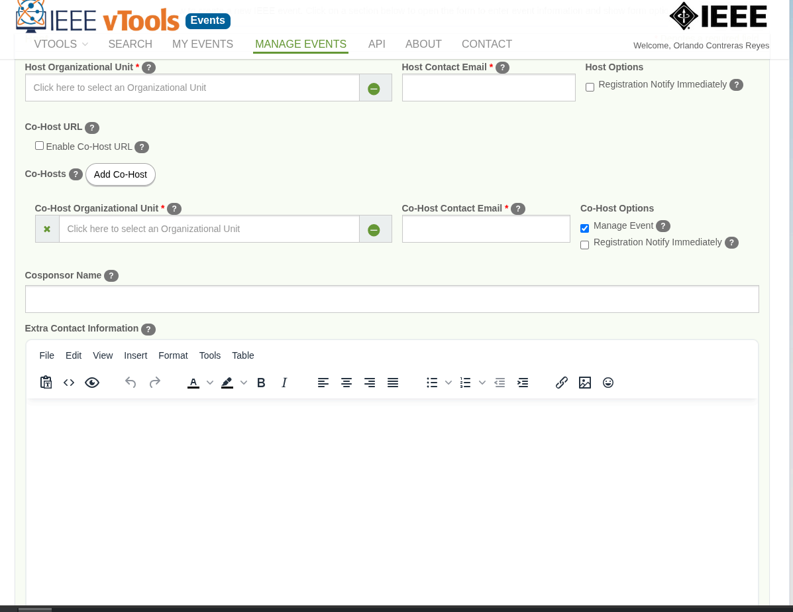
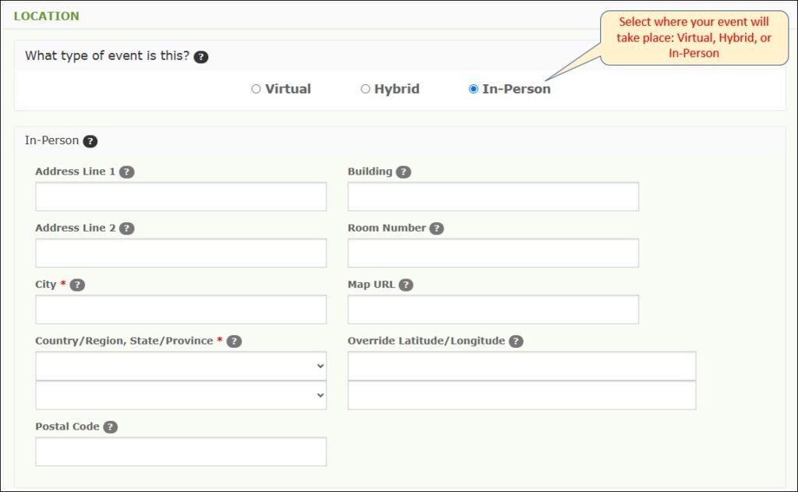
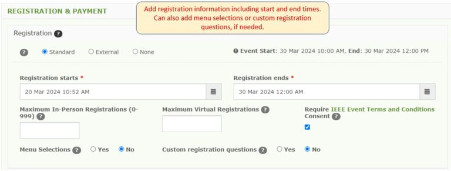
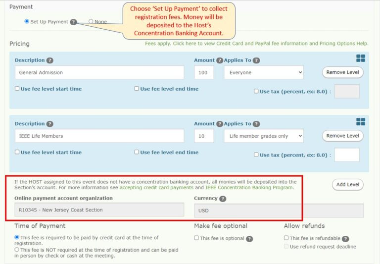
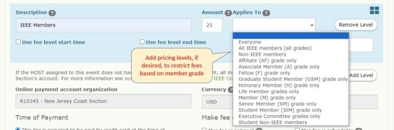
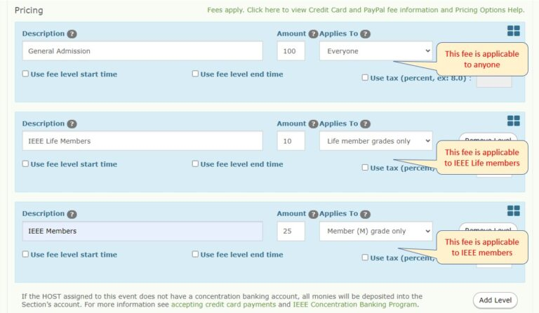

# Crear un Evento
[[index]]
# Crear un evento
## Video Tutorial
[Video Tutorial](https://youtu.be/jJXJr2SMHEs?si=Aw08pzxD4IWeVhk0)

## TUtorial
Iniciar sesion en [IEEE](https://events.vtools.ieee.org/) 

Una vez iniciada la sesión, hacer click en "Create Event"

Rellenar los campos del formulario, y hacer click en "Save as Draft"

Aqui aparecen los campos que se deben rellenar, es importante que se maneje un correo de la rama estudiantil, en caso de que sea un evento en colaboración con otra rama estudiantil, rellenar el espacio de Co-Host 

SBC- Student Branch Chapter (Capitulo de afinidad)
STB – Student Branch
WIE- Woman in Engineering Affinity group
YP- Young Professional Affinity group

### Location
The location panel is where you would select whether your event is virtual (e.g., WebEx, Google Meet, ZOOM, etc), in-person at a physical location, or hybrid (both virtual and in-person). If an address is entered, the system will auto-generate a map once you publish the event.

If you select “Virtual,” include the link for registrants to access the event. Note: You do not need to include the link right away. Some event hosts choose to send the link to participants closer to the date of the event. If you do not yet have a Webex or other URL to join the event, you can enter “Coming Soon,” or “TBD” or something similar to indicate to attendees that the virtual information is coming. Once you have obtained the virtual information, you can go back and add it in by editing the event, or you may choose to send an eNotice from the event to share the URL. See the following tutorials for help with that:

Note: Any links added to the event will be obfuscated from users who are not signed in to vTools. However, if they complete the ReCAPTCHA or sign in with their IEEE Account, the link will then be visible.

## Registro y pago

Select either “Standard,” or “External,” registration which would utilize an external registration site such as EventBrite or Cvent. If no registration is required, select “None.”

Select the start and end dates/times for registration. Other options to select:

Maximum # of registrants (if space/bandwidth is limited)
Menu selections, if applicable
Custom registration questions, if needed
Enabling Payment Functionality using Primary Host Concentration Banking accountTo top
In order to set up payment for an event, registration dates are required. Select “Set up Payment” to show pricing information. Note: If the primary Host OU does not have a Concentration Banking account, the account will default to the parent Section. If the Section does not have an account, please contact mga-im@ieee.org to start the process for setting up an account.

Optional Pricing Levels – Price Restrictions based on Member GradeTo top
Specify who qualifies for a given price level based on their association with IEEE or member grade.

Example: You can provide discounted pricing to IEEE members and student members. Registrants will be required to either sign in or provide their member number to qualify for the discounted price level. The system will use the member number to check the registrant’s member status (active/inactive) and current member grade.

Note: If you are using start and end times for registration levels, there can be no gaps between the end time of one level and the start time of another level! E.g. if the end time of one level is 24 March 2024 10:42 AM, then the start time of the next level must also be 24 March 2024 10:42 AM. If there are even 1-minute gaps, this will cause an error in vTools.