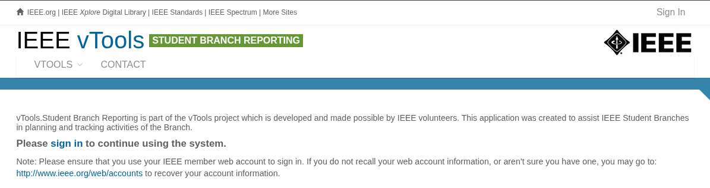
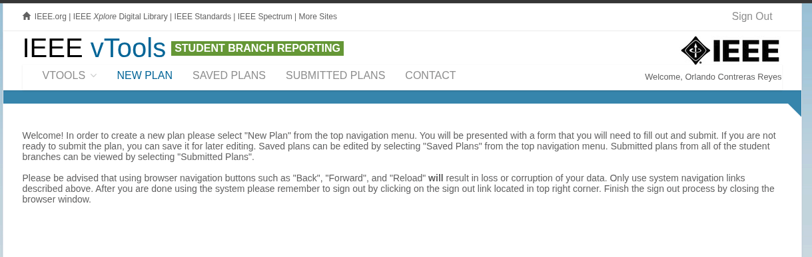
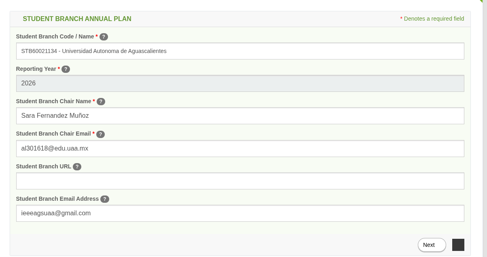
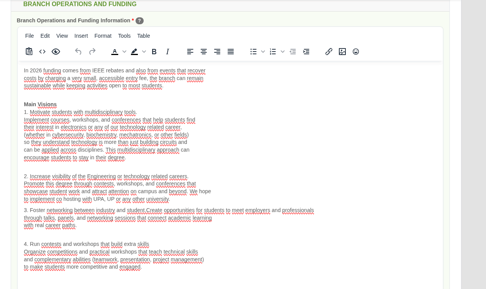
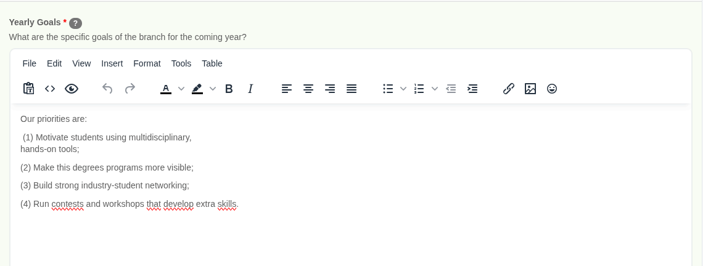
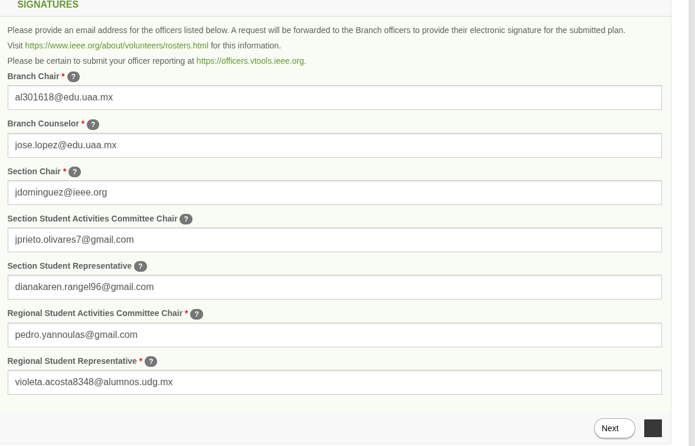
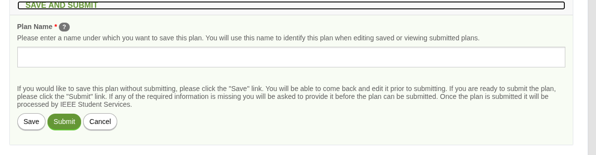

# Plan Anual
[[index]]

## Video Tutorial
[Video Tutorial](https://www.youtube.com/watch?v=V822Udy-bpQ&feature=youtu.be)

## Tutorial
Iniciar sesion en [IEEE Student Branch Report](https://sbr.vtools.ieee.org/)

Una vez iniciada la sesión, hacer click en "New Plan"

## Student Branch Annual Plan
Rellenar los espacios con la siguiente informacion
* Codigo de la rama estudiantil
* Año a reportar
* Nombre del presidente de la rama estudiantil
* Correo del presidente de la rama estudiantil

Opcionalmente pueden añadir un correo, se recomienda manejar un correo para la rama estudiantil

## Branch Operations and Funding
En esta seccion se detallara lo que se hara a lo largo del año y como será financiado, en caso de ser el segundo año que realizan plan deberá mencionarse el presupuesto con el que se cuenta

## Activities
En esta seccion se anotaran las actividades por mes, se sugiere un minimo de 4 actividades, a lo largo del año se iran reportando estas actividades por medio de [[Event Vtools]].

Como consejo para trabajar de forma rapida se sugiere usar "TAB" y "SHIFT + TAB" para desplazarse a traves de las celdas

## Goals
En esta seccion se mencionara brevemente las metas del año

## Signatures
En esta seccion se deberan de rellenar las celdas con los correos de cada representante
* Presidente de la rama estudiantil
* Consejero de la rama estudiantil
* Presidente de la seccion Aguascalientes
* Presidente de las Ramas estudiantiles de la seccion
* Representante de las ramas estudiantiles de la seccion
* Representante de las ramas estudiantiles de la region
* Presidente de las ramas estudiantiles de la region
Para mas informacion ver [Roles]

# Save and Submit
Finalmente se registra el plan anual bajo el nombre escrito en la celda. Se sugiere guardar y revisar varias veces y ya despues subir el plan.
