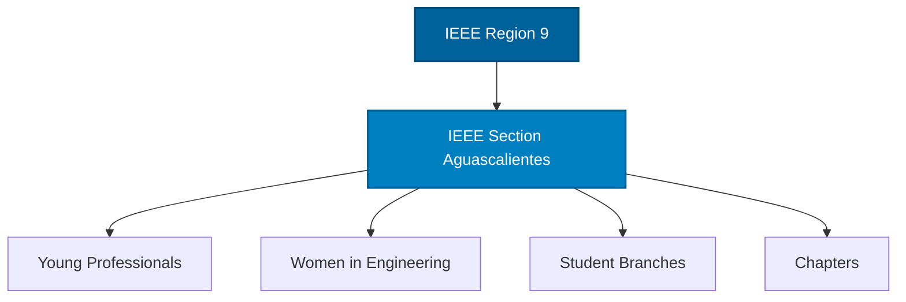

[IEEE Original Link](https://kb.ieee.org/vtools/blog/kb/creating-an-event/)
Esta wiki es una plataforma colaborativa para compartir conocimientos y recursos relacionados con el Instituto de Ingenieros Eléctricos y Electrónicos (IEEE). Aquí, puedes encontrar información sobre eventos, proyectos e iniciativas de IEEE, así como contribuir con tu propio contenido.


[[vToolsEvents]]

[[vToolsStudentBranch]]

## Organigrama



## Organigrama
* IEEE Region 9
    * IEEE Section Aguascalientes
        * Young Professionals
        * Women in Engineering
        * Student Branches
        * Chapters


**IEEE Region 9**
* **Director** - Jose Ignacio Castillo
* **Treasurer** - Armando Ruiz
* **Secretary** - Andrea Jurado
* **Director Elect** - Jose Cely
* **Past Director**   - Jennifer Castillo

**IEEE Ags**
* **Chair** - Julieta Dominguez
* **Vice Chair** - Alejandro Roman Loera
* **Secretary** - Enrique Garrido
* **Treasurer** - Melanie Mata
* **Student Activities Committee** - Josue Antonio Prieto Olivares

**IEEE Young Professionals**
* **Chair** - Tania Ramirez
* **Vice Chair** - David Vitelas

## Recursos
### WebPage
Para editar la pagina web basta con editar los archivos en la carpeta content(WebPage/content) y luego subir los cambios a la rama v5, para que se despliegue automaticamente en la pagina web.


Para subir la pagina a produccion 
```bash
npx quartz sync
```
* Siempre se debe trabajar en la rama v5


### BuscaChambas3000
El [BuscaChambas3000](https://dasreyxr.github.io/Directoriodejales/) es un listado de oportunidades laborales, programas de prácticas profesionales (internships) y certificaciones, orientado principalmente a estudiantes y recién egresados de áreas de ingeniería y tecnología. El proyecto utiliza archivos JSON como fuente de datos y una interfaz web estática para consultar, filtrar, editar y exportar información sin necesidad de un servidor.
### VTools
### Event-Drafter

El proyecto [Event-Drafter](https://github.com/DasReyxr/IEEE/tree/main/scripts/Event_VTools) es una herramienta para automatizar la creación de eventos en vTools, utilizando Python y Playwright para interactuar con la interfaz web de vTools y completar los formularios de eventos de manera automática. El proyecto está diseñado para ser modular y extensible, permitiendo a los usuarios agregar nuevas secciones de formularios y personalizar el comportamiento del bot según sus necesidades. 

El objetivo del proyecto es simplificar y agilizar el proceso de creación de eventos en vTools, reduciendo la carga de trabajo manual y mejorando la eficiencia en la gestión de eventos para los miembros de IEEE. Sin embargo, es importante que los usuarios **revisen y validen** la información generada por el bot antes de enviar el evento, para garantizar la precisión y la calidad de los datos ingresados en vTools.