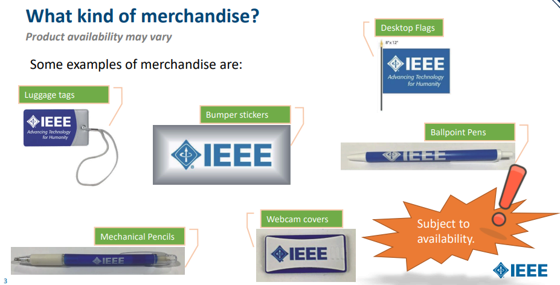

[[index]]

# [[Pedir cosas]] 
## Tutorial para Merchandising Materials
Por parte de la IEEE, se puede pedir cosas como:

### IEEE Tutorial
[IEEE Merch](https://ieee.org.mx/wp-content/uploads/2023/03/Copy-of-MDKITS.pdf)

### Video Tutorial
Tutorial: [Merch](https://youtu.be/idCgt4Oa6CQ)

### Tutorial
Para pedir cosas, se debe de iniciar sesion en [IEEE Merch](https://ieee.org.mx/wp-content/uploads/2023/03/Copy-of-MDKITS.pdf) y hacer click en "Request Merchandise" y llenar el formulario con la informacion solicitada, una vez llenado el formulario, se debe de esperar a que la IEEE apruebe la solicitud y se enviara un correo con la informacion de envio.

# [[Asignar Puestos]]
### IEEE Tutorial
[Agregar y eliminar puestos](https://kb.ieee.org/vtools/blog/kb/adding-an-officer-to-an-organizational-unit/)

### Video Tutorial
[Video Tutorial](https://youtu.be/SDSE6cdCsrc)

### Tutorial
Para asignar los puestos de la rama estudiantil, se debe de iniciar sesion en [Office Reporting](https://or.vtools.ieee.org/) y hacer click en "Assign Positions"

